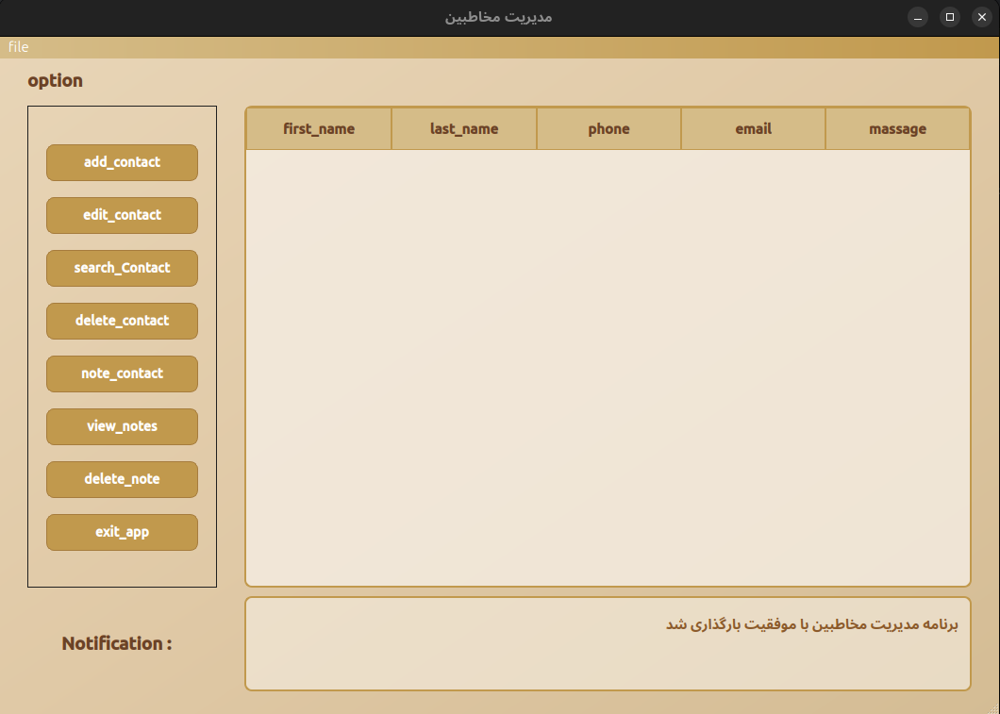

 # مدیریت مخاطبین
 


یک برنامه مدیریت مخاطبین با رابط کاربری گرافیکی ساخته شده با PyQt6. این برنامه امکان ایجاد، ویرایش، حذف و جستجوی مخاطبین را فراهم می‌کند.

## امکانات

- افزودن مخاطب جدید
- ویرایش اطلاعات مخاطبین
- حذف مخاطبین
- جستجو در مخاطبین
- افزودن یادداشت برای هر مخاطب
- مشاهده یادداشت‌های مخاطبین
- حذف یادداشت‌ها
- ورود و خروج داده به فرمت CSV
- انتخاب تم‌های مختلف (20 تم استاندارد و 20 تم پریمیوم)

## ساختار پروژه

- `main.py`: نقطه ورود برنامه
- `models/`: حاوی کلاس‌های مدل
- `ui/`: حاوی فایل‌های مربوط به رابط کاربری
- `utils/`: ابزارهای کمکی
- `resources/`: منابع مورد نیاز مانند تصاویر و استایل‌ها
- `contact_manager.py`: واسط UI اصلی

## نصب

1. کلون کردن مخزن:
```
git clone https://github.com/YOUR_USERNAME/contact-manager.git
cd contact-manager
```

2. نصب وابستگی‌ها:
```
pip install -r requirements.txt
```

3. اجرای برنامه:
```
python main.py
```

## نیازمندی‌ها

- Python 3.6+
- PyQt6
- PySide6 (اختیاری، برای رندر بهتر فونت‌ها)

## تم‌های پریمیوم

این برنامه دارای 20 تم پریمیوم با طراحی منحصر به فرد است. برای تغییر تم می‌توانید از منوی برنامه گزینه "تغییر تم برنامه" را انتخاب کنید.

## مجوز

این پروژه تحت مجوز MIT منتشر شده است.