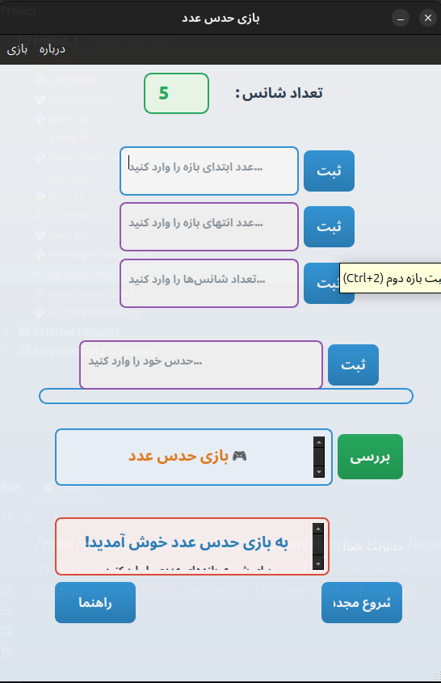

 # بازی حدس عدد


## توضیحات

بازی حدس عدد یک برنامه ساده و سرگرم‌کننده با رابط کاربری گرافیکی است که با استفاده از PyQt6 ساخته شده است. در این بازی، کاربر باید یک عدد تصادفی را که برنامه انتخاب کرده است، حدس بزند.

## ویژگی‌ها

- رابط کاربری زیبا و جذاب با گرادیان‌های رنگی
- امکان تعیین محدوده اعداد توسط کاربر
- امکان تعیین تعداد شانس‌های حدس
- پیام‌های راهنما با طراحی HTML برای تجربه کاربری بهتر
- اعلان‌های رنگی برای نمایش وضعیت بازی (برد، باخت، خطا)
- تغییر رنگ عناصر با تغییر وضعیت بازی

## نحوه استفاده

1. بازه اول (عدد کوچکتر) را وارد کنید
2. بازه دوم (عدد بزرگتر) را وارد کنید
3. تعداد شانس‌های حدس را تعیین کنید (اختیاری، پیش‌فرض: 5)
4. حدس خود را وارد کنید
5. دکمه "بررسی" را بزنید
6. از راهنمایی‌ها استفاده کنید و حدس بعدی خود را ارائه دهید

## پیش‌نیازها

برای اجرای این برنامه، به موارد زیر نیاز دارید:

- Python 3.6 یا بالاتر
- PyQt6

## نصب

ابتدا مخزن را کلون کنید:

```bash
git clone https://github.com/yourusername/guess-number-game.git
cd guess-number-game
```

سپس وابستگی‌های مورد نیاز را نصب کنید:

```bash
pip install -r requirements.txt
```

## اجرا

برای اجرای بازی، دستور زیر را وارد کنید:

```bash
python main.py
```

## ساختار پروژه

- `main.py`: فایل اصلی برنامه که منطق بازی و رابط کاربری را مدیریت می‌کند
- `game.py`: کلاس `Ui_MainWindow` که توسط Qt Designer تولید شده است
- `game.ui`: فایل طراحی رابط کاربری که با Qt Designer ایجاد شده است
- `screenshots/`: تصاویر نمایشی از بازی
- `requirements.txt`: لیست وابستگی‌های پروژه

## مجوز

این پروژه تحت مجوز MIT منتشر شده است. برای اطلاعات بیشتر، فایل [LICENSE](LICENSE) را مطالعه کنید.