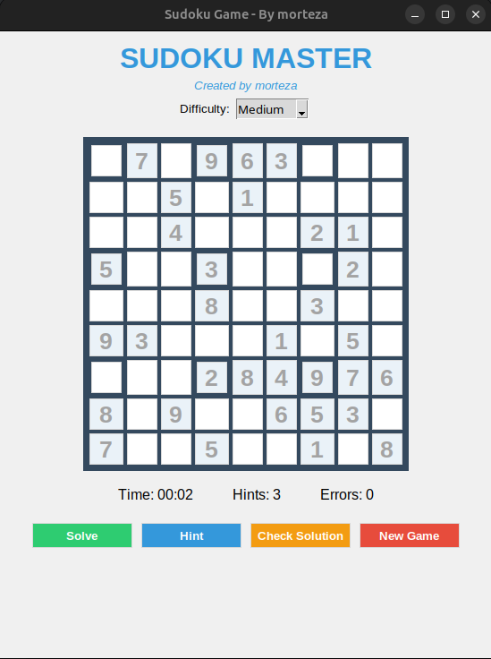

# Sudoku Master

A beautiful, feature-rich Sudoku game built with Python and Tkinter, created by Rachel.

  

## ✨ Features

- **Multiple Difficulty Levels**: Easy, Medium, and Hard puzzles
- **Smart Hint System**: Get help with 3 hints per game
- **Real-time Validation**: Immediate feedback on cell entries
- **Timer**: Track your solving time
- **Error Counter**: Keep track of mistakes
- **Smart Highlighting**: Related cells (row, column, box) are highlighted when selecting a cell
- **Solution Checker**: Verify your progress at any time
- **Auto-Solve**: Complete the puzzle instantly
- **Modern UI**: Clean, visually appealing interface with a thoughtful color scheme
- **Responsive Design**: Works on different screen sizes

## 🚀 Installation

### Prerequisites
- Python 3.6 or higher
- Tkinter (usually included with Python installations)

### Steps
1. Clone or download this repository
2. Navigate to the project directory
3. Run the game:
   ```bash
   python sudoku.py
   
🎮 How to Play

    Select Difficulty: Choose from Easy, Medium, or Hard using the dropdown menu

    Fill Cells: Click on an empty cell and enter a number from 1-9

    Get Help: Use the Hint button if stuck (limited to 3 hints per game)

    Check Progress: Verify your solution with the Check Solution button

    Complete: Finish the puzzle or use Solve to auto-complete

    New Game: Start a fresh puzzle with the New Game button

🎯 Controls

    Mouse: Click to select cells

    Keyboard: Type numbers 1-9 to fill selected cells

    Navigation: Use arrow keys or Tab to move between cells

🏆 Difficulty Levels

    Easy: 40-45 empty cells

    Medium: 46-50 empty cells

    Hard: 51-55 empty cells

🛠️ Technical Details

This project demonstrates:

    Object-oriented programming in Python

    GUI development with Tkinter

    Algorithm implementation for puzzle generation and solving

    Backtracking algorithm for solving Sudoku puzzles

    Event-driven programming

The game features:

    Responsive UI with modern color scheme

    Input validation and error handling

    Real-time game state tracking

    Efficient puzzle generation using constraint propagation

📋 Requirements

The game requires only Python's standard library:

    Python 3.6+

    Tkinter (included with Python)

