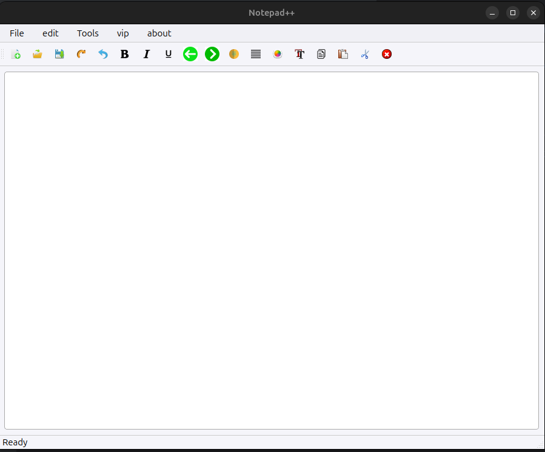

# Notepad++

A modern text editor built with PyQt6, featuring rich text formatting and file management capabilities.

## Features

- Create, open, save text files
- Format text (bold, italic, underline)
- Align text (left, right, center, justify)
- Change text color and font
- Export to PDF
- Print documents
- Modern, attractive UI

## Screenshots



## Installation

1. Clone this repository:
```
git clone https://github.com/your-username/note-plus-plus.git
cd note-plus-plus
```

2. Install the required packages:
```
pip install -r requirements.txt
```

3. Run the application:
```
python main.py
```

## Requirements

- Python 3.6+
- PyQt6

## License

MIT License

---

