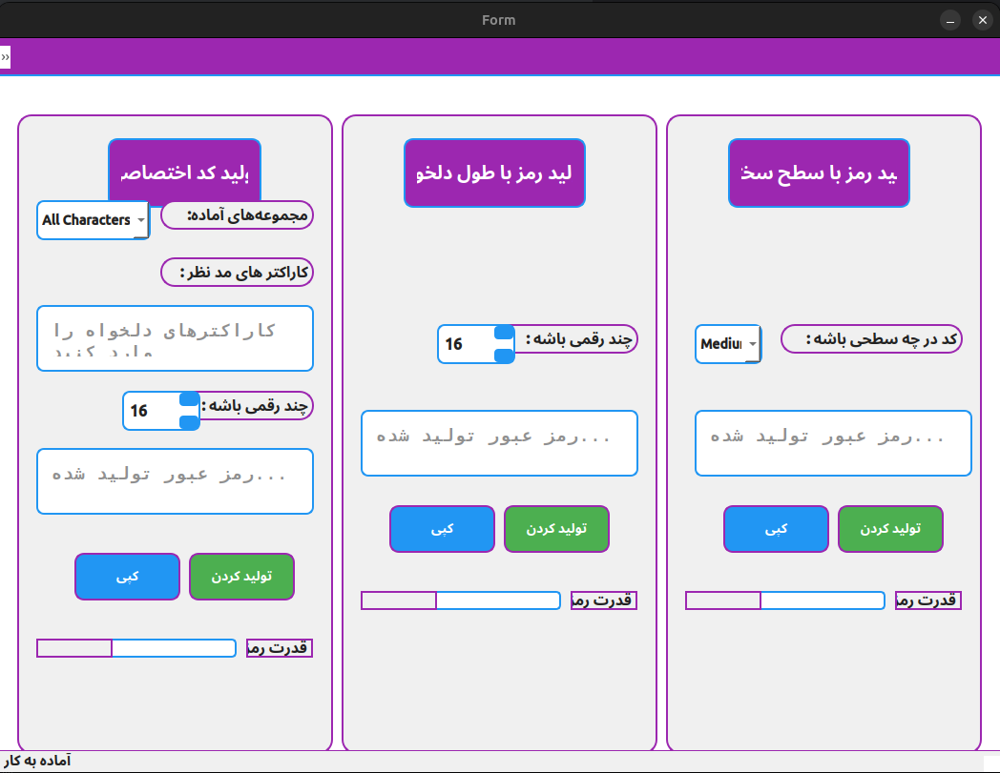

# Persian Password Generator

A modern, elegant password generator application with a beautiful user interface built with PyQt6. This application has been refactored into a modular, object-oriented structure for better maintainability and extensibility.



## Features

- **Three Password Generation Methods**:
  - **Fixed Difficulty Levels**: Choose from Easy (8 characters), Medium (16 characters), or Hard (32 characters)
  - **Custom Length**: Generate passwords of any length between 1-100 characters
  - **Custom Character Set**: Create passwords using only characters you specify

- **Enhanced Security Features**:
  - **Password Strength Evaluation**: Visual indicators show how strong your password is
  - **Strength Rating**: Get a rating (ضعیف/متوسط/خوب/عالی) for each generated password
  - **Security Feedback**: Receive suggestions on how to improve your passwords
  - **Predefined Character Sets**: Choose from common character sets for different security needs

- **Beautiful User Interface**:
  - Modern black and gold theme with orange and green accents
  - Highly readable text fields with monospace font
  - Responsive buttons with hover effects
  - Status messages for operations
  - Animated password generation with progress tracking

- **Convenience Features**:
  - Copy passwords to clipboard with a single click
  - Input validation to prevent errors
  - Persian language interface
  - Visual feedback for all actions
  - Menu interface for additional functionality

## Architecture

The application is structured as follows:

```
password_generator/
├── __init__.py                 # Package root
├── __main__.py                 # Entry point
├── core/                       # Core functionality
│   ├── __init__.py
│   └── generator.py            # Password generator classes
├── ui/                         # User interface
│   ├── __init__.py
│   ├── base.py                 # Base window class
│   ├── generated.py            # Generated UI code
│   ├── main_window.py          # Main window implementation
│   └── styles.py               # UI style definitions
└── utils/                      # Utilities
    ├── __init__.py
    └── threads.py              # Worker thread implementation
```

### Inheritance Structure

The application uses inheritance for code reuse and modularity:

1. **Generators**:
   - `PasswordGenerator` (Abstract Base Class)
     - `DifficultyPasswordGenerator`
     - `CustomLengthPasswordGenerator`
     - `CustomCharSetPasswordGenerator`

2. **UI**:
   - `BaseWindow` (Base class with common functionality)
     - `MainWindow` (Main application window, also inherits from `Ui_Form`)

## Installation

### Prerequisites

- Python 3.6+
- PyQt6

### Option 1: Install via pip (Recommended)

```bash
# Install directly from GitHub
pip install git+https://github.com/your-username/password-generator.git

# Run the application
password-generator
```

### Option 2: Manual Installation

```bash
# Clone the repository
git clone https://github.com/your-username/password-generator.git
cd password-generator

# Create a virtual environment (optional but recommended)
python -m venv venv
source venv/bin/activate  # On Windows: venv\Scripts\activate

# Install the package
pip install -e .

# Run the application
password-generator
```

### Option 3: Development Mode

```bash
# Clone the repository
git clone https://github.com/your-username/password-generator.git
cd password-generator

# Create a virtual environment (optional but recommended)
python -m venv venv
source venv/bin/activate  # On Windows: venv\Scripts\activate

# Install dependencies
pip install -r requirements.txt

# Run the application
python -m password_generator
```

## Usage

The application has three main sections:

### 1. Password Generation by Difficulty Level

1. Select the difficulty level from the dropdown menu (Easy, Medium, Hard)
2. Click the "تولید کردن" (Generate) button
3. The password will appear in the text field
4. Click the "کپی" (Copy) button to copy it to your clipboard

### 2. Custom Length Password Generation

1. Set the desired password length using the number spinner
2. Click the "تولید کردن" (Generate) button
3. The password will appear in the text field
4. Click the "کپی" (Copy) button to copy it to your clipboard

### 3. Custom Character Set Password Generation

1. Enter the characters you want to use in the upper text field
2. Set the desired password length using the number spinner
3. Click the "تولید کردن" (Generate) button
4. The password will appear in the lower text field
5. Click the "کپی" (Copy) button to copy it to your clipboard

## Customization

You can customize the application's appearance by modifying the `StyleManager` class in `password_generator/ui/styles.py`.

## Extending the Application

To add new generator types:

1. Create a new class that inherits from `PasswordGenerator` in `password_generator/core/generator.py`
2. Implement the `generate()` method
3. Add UI elements to utilize your new generator

## License

This project is licensed under the MIT License - see the LICENSE file for details.

## Author

Created by Mory

## Acknowledgments

- PyQt6 for the GUI framework
- Password security best practices from NIST guidelines 